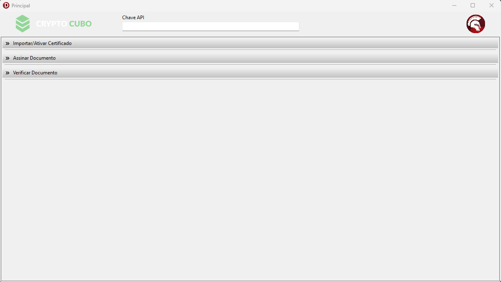
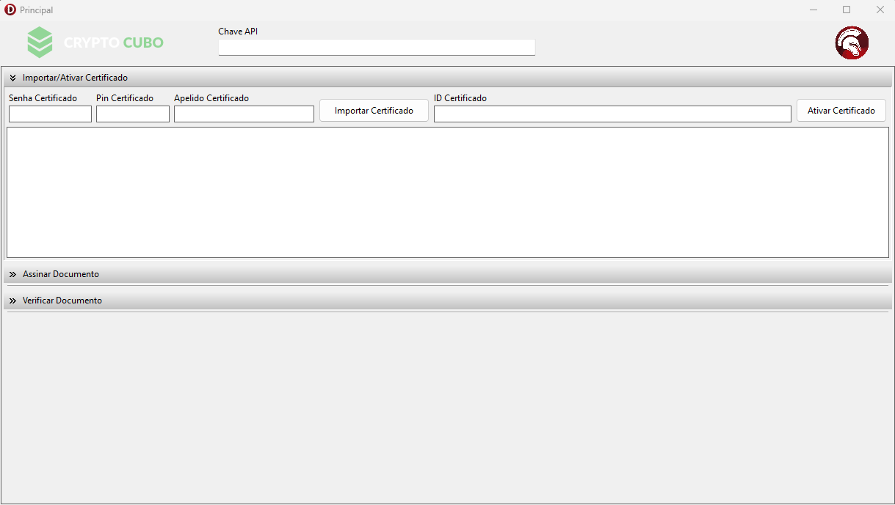
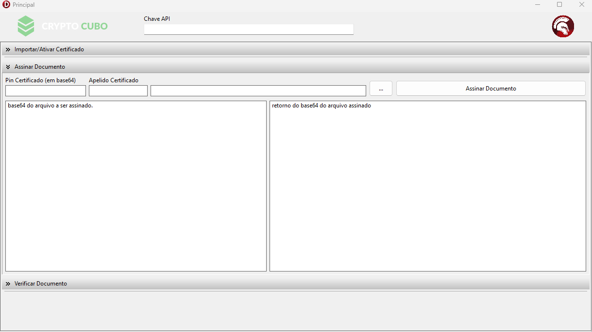
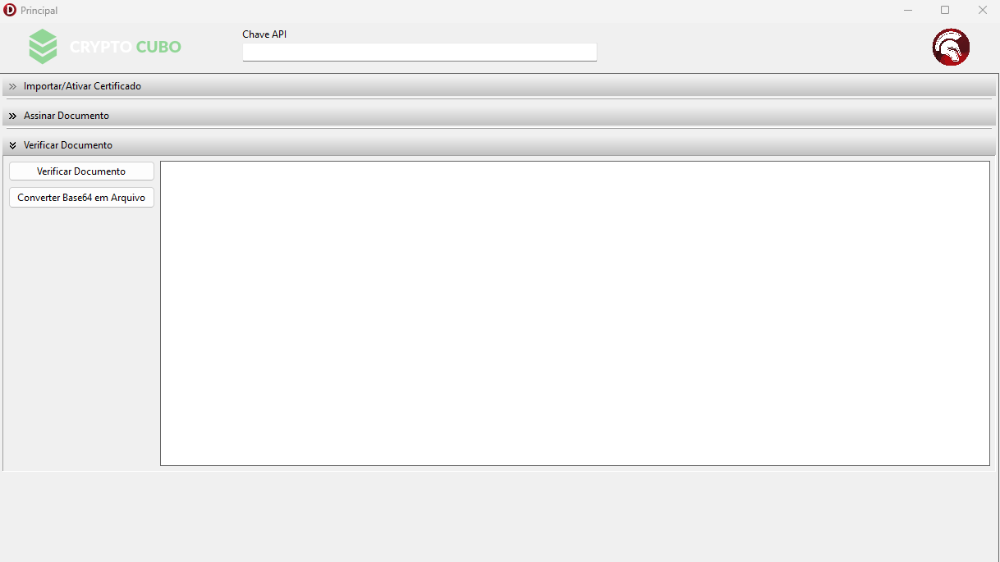

<h1>CrypoCubo</h1>

## Descrição do projeto

  projeto tem a finalidade de assinar documentos digitalmente. 

> Status do Projeto: ✅ concluido

## Funcionalidades

:heavy_check_mark: Importar/ativar certificado

:heavy_check_mark: Assinar documento

:heavy_check_mark: Verificar documento

## Tutorial de uso.

1. fazer o cadastro no site da CryptoCubo e gerar sua chave da api.

2. Inserir a chave api no programa.
<>

3. Importar e ativar o certificado (A1)
Informar a senha do certificado, informar um PIN, um apelido e por fim, colocar a string base64 do certificado. Ocorrendo tudo certo, é só ativar ele.
<>

4. Assinar o documento (pfds)
Informar o PIN do certificar já importado e assinado. o PIN deve estar em base64. Informar o apelido, buscar o arquivo e colocar a string base64 dele. Depois disso é só apertar em Assinar Documento. Ocorrendo tudo certo, irá aparecer a string base64 do arquivo assinado.
<>

5. Verificar o Documento
Por fim, para validar que o arquivo foi assinado, é só apertar o botão de Verificar Documento. Ele irá usar as strings base64 do arquivo a ser assinado e o seu retorno. Ele irá gerar outra string base64 final e depois só apertar o botão de Converter Base64 em Arquivo.
<>

## Tarefas em aberto

Se for o caso, liste tarefas/funcionalidades que ainda precisam ser implementadas na sua aplicação

:memo: colocar um loading a executar as ações;

:memo: melhorar a codificação

:memo: aplicar clean code

## Tecnologias

As seguintes ferramentas foram usadas na construção do projeto:

- [Delphi](https://embarcadero.com)

## Licença

The [MIT License]() (MIT)

Copyright :copyright: 2024 - CryptoCubo
